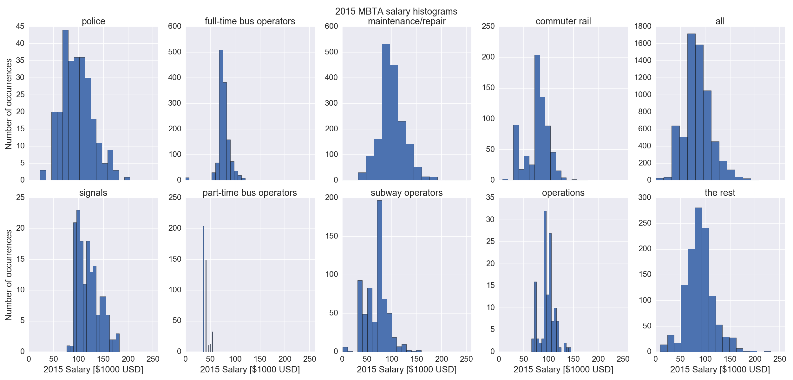
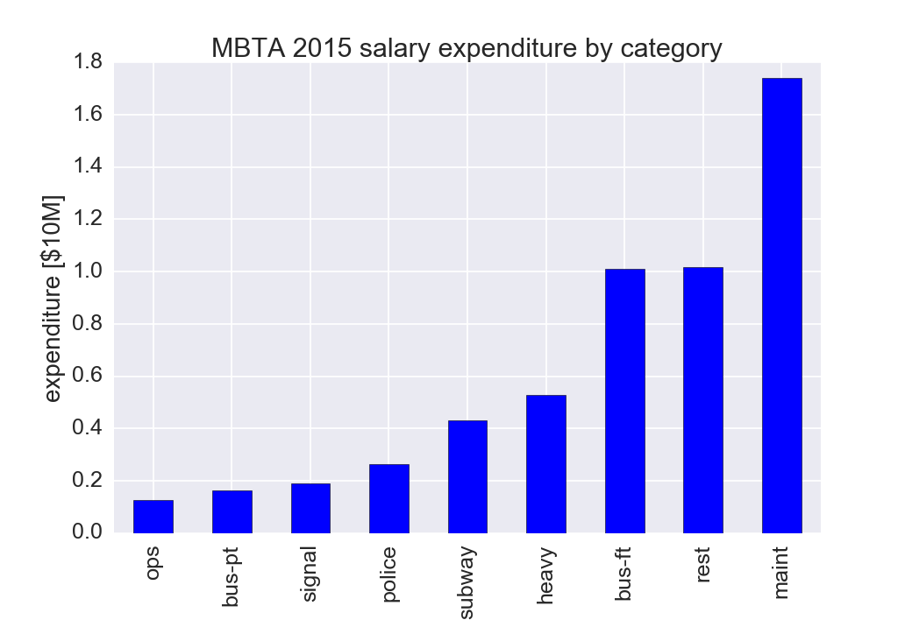

# MBTA Salary Analysis

[](http://pepy.tech/project/mbtasalary)

Note: Massachusetts Comptroller now has an
[online Massachusetts salary database](http://cthrupayroll.mass.gov/)
from 2010 onward, that is not yet handled by this program.

---

Year 2015 data thanks to Matthew Rocheleau, the Boston Globe staff reporter on the
[22 Dec 2015 MBTA overtime article](http://www.bostonglobe.com/2015/12/21/mbta-employees-who-will-make-more-than-this-year/u6BUkDr6EawQ7dlHx9bZQP/story.html).

1. extract text tables from PDF using Poppler `pdftotext`
2. load with Pandas
3. look for interesting aspects of the data.

For example, in 2014, the top MBTA earner was a Technician with an
estimated $145 K of overtime on top of an $89 K salary. Excessive
overtime can be a concern for worker performance and safety in any
field, with possible drastic consequences for the public when working in
sensitive areas like transportation and medicine.

The Washingtonian published a 9 Dec 2015
[article](http://www.washingtonian.com/blogs/capitalcomment/transportation/why-does-metro-suck-dangerous-accidents-escalator-outages.php)
by Luke Mullins and Michael Gaynor that explores at length issues with WMATA and overtime abuses.

Backpay is excluded as it represents a retroactive increase in base salary for the previous year.
Backpay is last year's pay, paid out this year.





## Examples

We currently have 2013-2015 salary data. Other trend analyses may find
it useful to request prior years data.

### 2015 MBTA Salary

```sh
MBTAsalary EMP-2015-Gross-Bpay-Ovt.xlsx 2015
```

yields plots and the output:

Highest earning MBTA staff $256080 in 2015 was a Foreperson,Section,
including estimated $171257 overtime.

 type   | max     | median  | 90th    | subtot  | num
--------|---------|---------|---------|---------|------
 signal | 182049  | 117083  | 151384  | > 2e+07 | > 157
 maint  | 256080  | > 97309 | 134881  | > 2e+08 | 1743
 ops    | 145266  | > 96538 | 113948  | > 1e+07 | > 128
 police | 203553  | > 93684 | 136959  | > 3e+07 | > 271
 heavy  | 178438  | > 80498 | 103964  | > 5e+07 | > 678
 bus-ft | 120281  | > 75542 | > 91287 | > 1e+08 | 1304
 subway | 158950  | > 73563 | > 94860 | > 4e+07 | > 628
 bus-pt | > 54738 | > 40934 | > 49124 | > 2e+07 | > 410
 rest   | 231589  | > 87497 | 122225  | > 1e+08 | 1149
 all    | 256080  | > 82319 | 118860  | > 5e+08 | 6468

### 2014 MBTA Salary

```sh
MBTAsalary Wages2014.txt 2014
```

yields plots and the output:

Highest earning MBTA staff $235194 in 2014 was a Technician,Power
Equip, including estimated $145401 overtime.

 type   | max     | median  | 90th    | subtot  | num
--------|---------|---------|---------|---------|------
 signal | 179689  | 110775  | 127210  | > 2e+07 | > 155
 police | 221910  | 107261  | 165080  | > 3e+07 | > 259
 maint  | 235194  | > 95772 | 131344  | > 2e+08 | 1727
 ops    | 138506  | > 93504 | 115208  | > 1e+07 | > 131
 heavy  | 224458  | > 90492 | 120647  | > 6e+07 | > 670
 bus-ft | 196809  | > 88447 | 109504  | > 1e+08 | 1337
 subway | 185242  | > 84203 | 111710  | > 4e+07 | > 576
 bus-pt | > 66435 | > 33326 | > 52231 | > 1e+07 | > 345
 rest   | 220000  | > 86463 | 129061  | > 1e+08 | 1132
 all    | 235194  | > 89251 | 123618  | > 5e+08 | 6332

### MBTA 2013 Salary

```sh
MBTAsalary "FOIA 14-11 final.txt" 2013
```

yields plots and the output:

Highest earning MBTA staff $238770 in 2013 was a General Manager

 type   | max     | median  | 90th    | subtot  | num
--------|---------|---------|---------|---------|------
 signal | 164161  | 109078  | 122121  | > 1e+07 | > 139
 police | 205400  | 108173  | 162941  | > 3e+07 | > 245
 maint  | 209113  | > 87132 | 113655  | > 1e+08 | 1705
 ops    | 127287  | > 82337 | > 98121 | > 1e+07 | > 131
 heavy  | 154684  | > 72266 | > 99978 | > 5e+07 | > 654
 bus-ft | 192440  | > 69327 | > 87284 | > 9e+07 | 1279
 subway | 133214  | > 66729 | > 87589 | > 3e+07 | > 517
 bus-pt | > 53263 | > 34434 | > 42247 | > 1e+07 | > 358
 rest   | 238770  | > 78120 | 112847  | > 9e+07 | 1098
 all    | 238770  | > 75818 | 108951  | > 5e+08 | 6126

## Obtaining Salary Data

You will need to download and convert the salary data first.
Each year's format is a little different.

### 2015 Salary Data

We obtained this data from Matthew Rocheleau, the Boston Globe staff reporter on the 22 Dec 2015
[MBTA overtime article](http://www.bostonglobe.com/2015/12/21/mbta-employees-who-will-make-more-than-this-year/u6BUkDr6EawQ7dlHx9bZQP/story.html).
We anticipate a request for the whole year 2015 data once we're into 2016.

### 2014 Salary Data

1.  Download 2014 MBTA
    [salary data](http://www.mbta.com/uploadedfiles/Smart_Forms/News,_Events_and_Press_Releases/Wages2014.pdf)
2.  Extract text from PDF:
    ```sh
    pdftotext -layout Wages2014.pdf
    ```

### 2013 Salary Data

1.  Download 2013 MBTA
    [salary data](http://www.mbta.com/uploadedfiles/Smart_Forms/News,_Events_and_Press_Releases/FOIA%2014-11%20final.pdf)
2.  Extract text from PDF:
    ```sh
    pdftotext -layout "FOIA 14-11 final.pdf"
    ```
3. The last three lines of this .txt file are missing a space between the salary and "2013".
   Just open in a text editor and manually add one additional space before 2013 in these last three lines.
