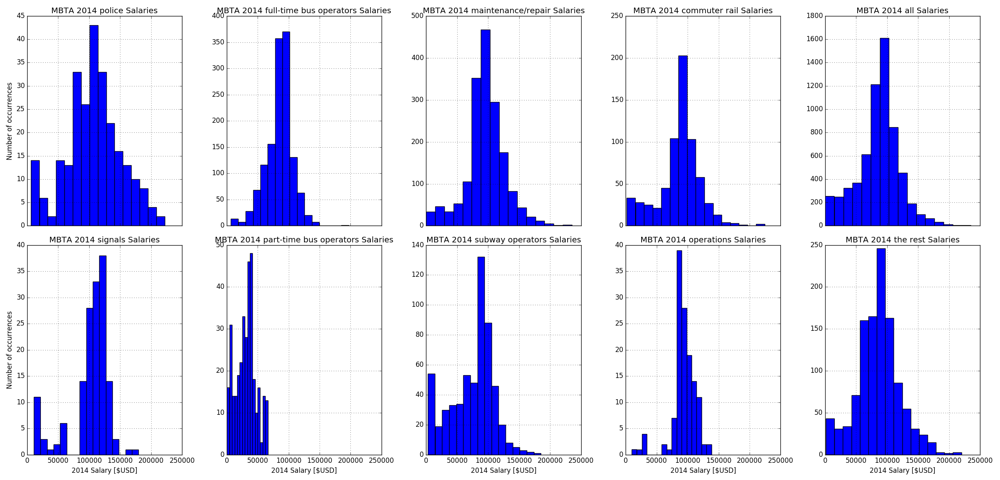
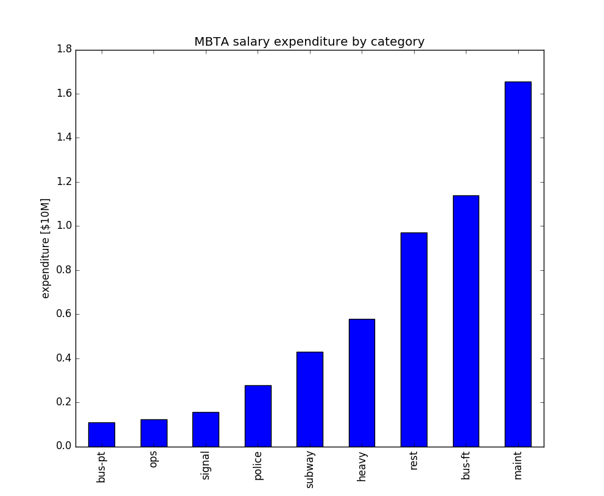

====================
MBTA Salary Analysis
====================

An example of extracting text tables from PDF, then loading with Pandas to look
for interesting aspects of the data.

For example, in 2014, the top MBTA earner was a Technician with an estimated $145 K of overtime on top of an $89 K salary.

Example
=======
::
    
    python salary.py

highest earning MBTA staff $235194 in 2014 was a Technician,Power Equip.

======  ======  ======  ======  ======  ====
type       max  median    90th  subtot   num
======  ======  ======  ======  ======  ====
signal  179689  110775  127210   2e+07   155
police  221910  107261  165080   3e+07   259
maint   235194   95772  131344   2e+08  1727
ops     138506   93504  115208   1e+07   131
heavy   224458   90492  120647   6e+07   670
bus-ft  196809   88447  109504   1e+08  1337
subway  185242   84203  111710   4e+07   576
bus-pt   66435   33326   52231   1e+07   345
rest    220000   86463  129061   1e+08  1132
all     235194   89251  123618   5e+08  6332
======  ======  ======  ======  ======  ====

One-time setup
==============

1. `Download 2014 MBTA salary data <http://www.mbta.com/uploadedfiles/Smart_Forms/News,_Events_and_Press_Releases/Wages2014.pdf>`_

2. Extract text from PDF, using `pdftotext <https://en.wikipedia.org/wiki/Poppler_%28software%29#poppler-utils>`_::

    pdftotext -layout Wages2014.pdf

